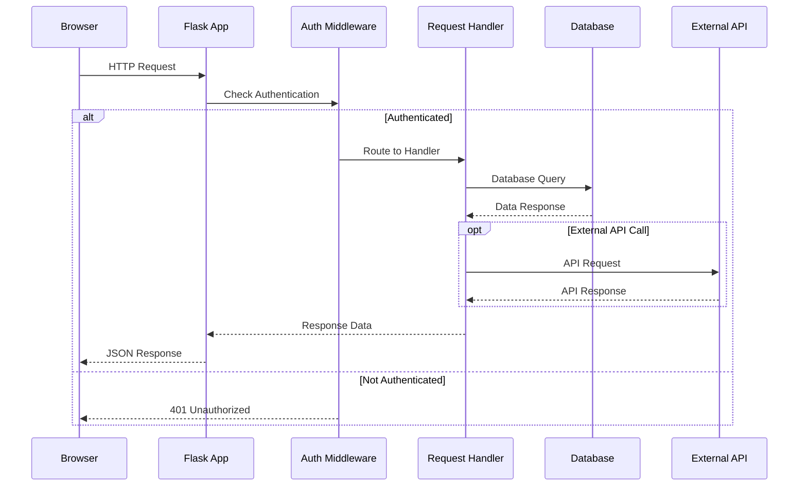
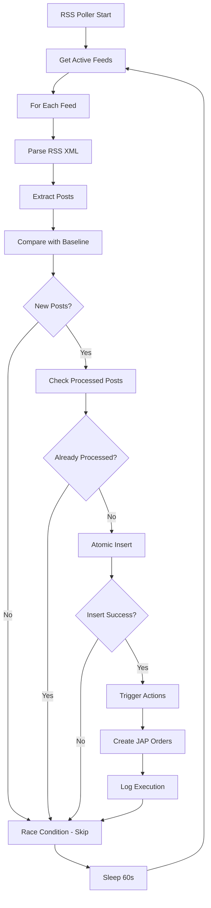
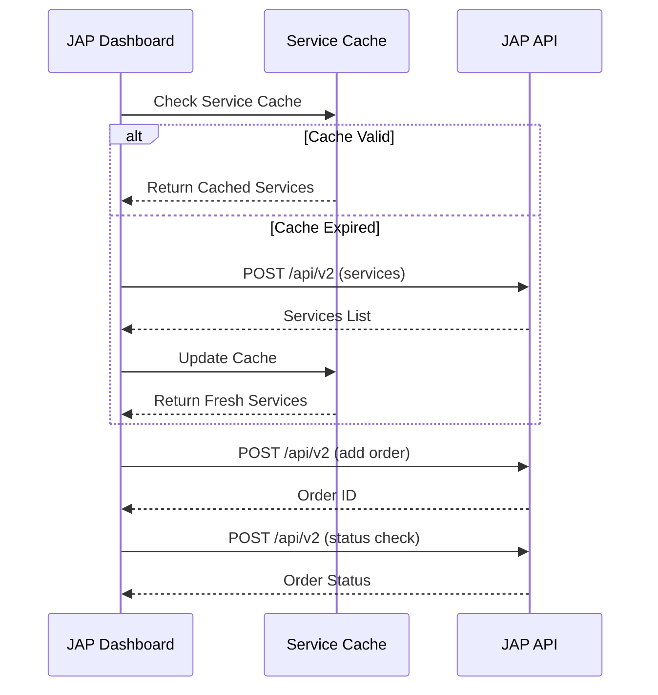
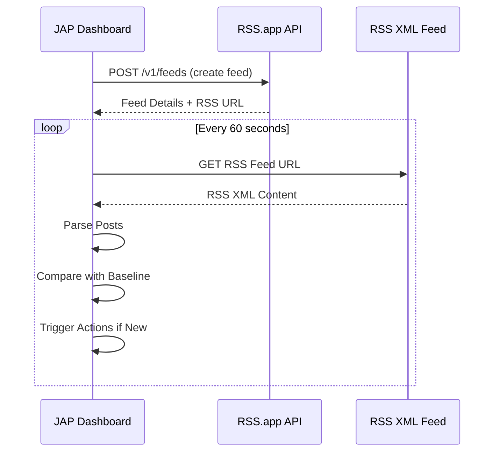
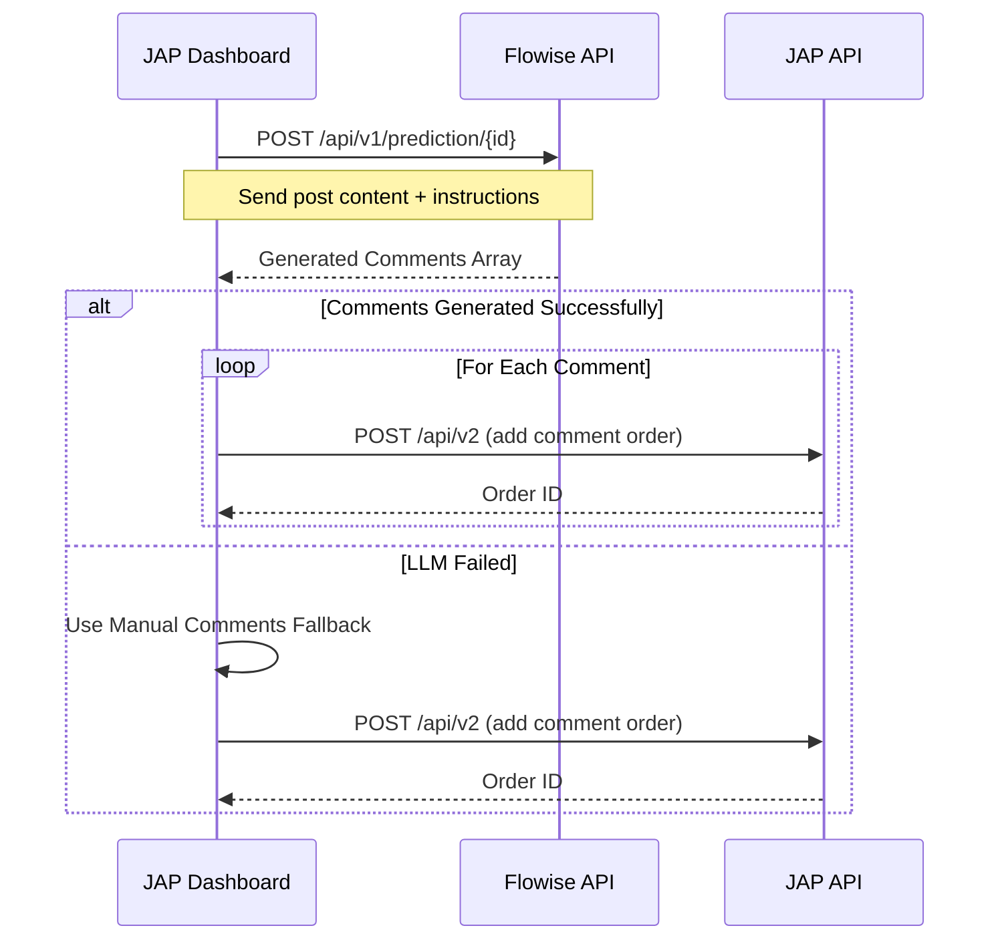
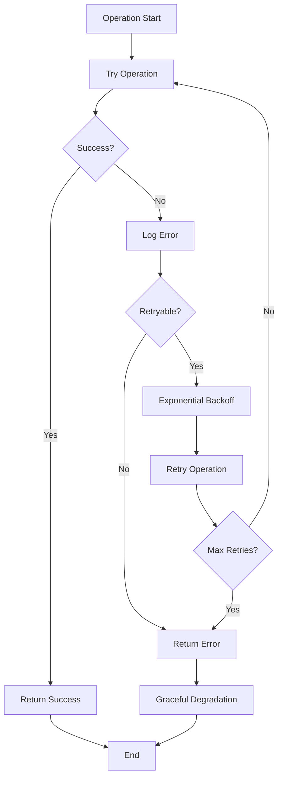
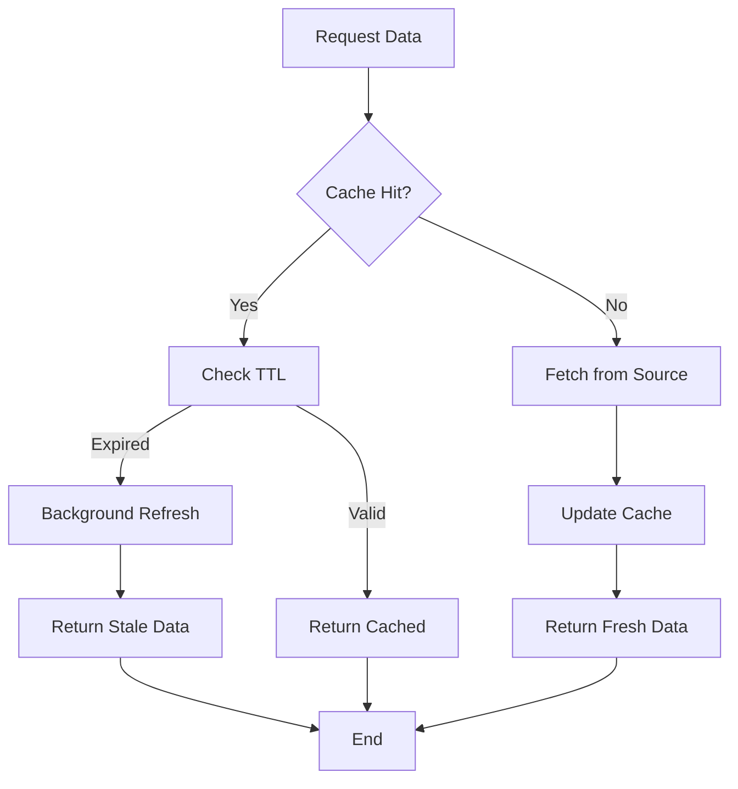
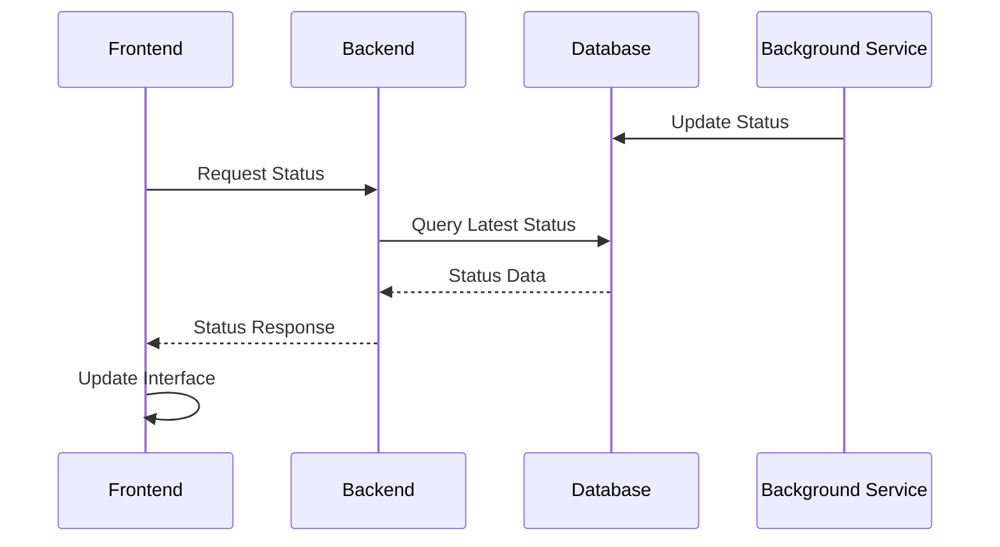

# Data Flow Architecture

This document details how data moves through the JAP Dashboard system, including request/response patterns, background processing, and integration workflows.

## Overview

The JAP Dashboard implements several distinct data flow patterns:

1. **Web Request Flow** - User-initiated actions via browser
2. **RSS Automation Flow** - Background RSS monitoring and triggering
3. **External API Flow** - Integration with JAP, RSS.app, and LLM services
4. **Database Transaction Flow** - Data persistence and retrieval

## 1. Web Request Flow

### Standard HTTP Request Pattern

```
Browser → Flask Router → Authentication → Handler → Database → Response
```

#### Detailed Flow:



### Example: Account Creation Flow

**Request Path**: `POST /api/accounts`

1. **Browser Request**:
   ```javascript
   fetch('/api/accounts', {
       method: 'POST',
       headers: {'Content-Type': 'application/json'},
       body: JSON.stringify({
           platform: 'instagram',
           username: 'example_user',
           url: 'https://instagram.com/example_user'
       })
   })
   ```

2. **Flask Processing**:
   ```python
   @app.route('/api/accounts', methods=['POST'])
   @smart_auth_required
   def create_account():
       data = request.get_json()
       
       # Validate input
       if not all(key in data for key in ['platform', 'username']):
           return jsonify({'error': 'Missing required fields'}), 400
       
       # Database insertion
       conn = get_db_connection()
       cursor = conn.execute("""
           INSERT INTO accounts (platform, username, display_name, url)
           VALUES (?, ?, ?, ?)
       """, (data['platform'], data['username'], 
             data.get('display_name', ''), data.get('url', '')))
       
       account_id = cursor.lastrowid
       
       # RSS feed creation (background task)
       create_rss_feed_async(account_id, data)
       
       conn.commit()
       return jsonify({'id': account_id}), 201
   ```

3. **Response Handling**:
   ```javascript
   .then(response => response.json())
   .then(data => {
       if (data.id) {
           // Update UI
           this.loadAccounts();
           this.showToast('Account created successfully');
       }
   })
   ```

---

## 2. RSS Automation Flow

### Background Processing Pattern

The RSS automation system operates independently of web requests, continuously monitoring feeds and triggering actions.



### Detailed RSS Processing

#### Phase 1: Feed Selection
```python
def get_polling_candidates():
    """Get feeds that should be polled"""
    conn = get_db_connection()
    
    # Only poll feeds that are:
    # - Active (is_active = 1)
    # - Have configured actions
    # - Account is enabled
    return conn.execute("""
        SELECT DISTINCT rf.id, rf.rss_feed_url, rf.last_post_date, 
               a.id as account_id, a.username
        FROM rss_feeds rf
        JOIN accounts a ON rf.account_id = a.id
        JOIN actions ac ON a.id = ac.account_id
        WHERE rf.is_active = 1 
        AND a.enabled = 1 
        AND ac.is_active = 1
    """).fetchall()
```

#### Phase 2: RSS Parsing
```python
def parse_rss_feed(feed_url):
    """Parse RSS feed and extract posts"""
    try:
        response = requests.get(feed_url, timeout=30)
        root = ET.fromstring(response.content)
        
        posts = []
        for item in root.findall('.//item'):
            post = {
                'title': item.find('title').text,
                'link': item.find('link').text,
                'guid': item.find('guid').text,
                'pub_date': parse_date(item.find('pubDate').text)
            }
            posts.append(post)
            
        return sorted(posts, key=lambda x: x['pub_date'], reverse=True)
    except Exception as e:
        log_error(f"RSS parse error: {e}")
        return []
```

#### Phase 3: Duplicate Prevention (Race Condition Fix)
```python
def process_new_post(feed_id, post):
    """Atomically process new post to prevent duplicates"""
    conn = get_db_connection()
    try:
        # Atomic insert - will fail if post already exists
        conn.execute("""
            INSERT INTO processed_posts 
            (feed_id, post_guid, post_url, post_title)
            VALUES (?, ?, ?, ?)
        """, (feed_id, post['guid'], post['link'], post['title']))
        
        conn.commit()
        return True  # Successfully claimed this post
        
    except sqlite3.IntegrityError:
        # Post already processed by another thread
        return False
```

#### Phase 4: Action Triggering
```python
def trigger_account_actions(account_id, target_url):
    """Trigger all active actions for an account"""
    conn = get_db_connection()
    
    actions = conn.execute("""
        SELECT id, jap_service_id, service_name, parameters
        FROM actions 
        WHERE account_id = ? AND is_active = 1
    """, (account_id,)).fetchall()
    
    triggered_count = 0
    for action in actions:
        try:
            # Create JAP order
            order_result = jap_client.create_order(
                service_id=action['jap_service_id'],
                link=target_url,
                quantity=json.loads(action['parameters'])['quantity']
            )
            
            # Record execution
            conn.execute("""
                INSERT INTO execution_history 
                (jap_order_id, execution_type, platform, target_url, 
                 service_id, service_name, quantity, account_id, account_username)
                VALUES (?, 'rss_trigger', ?, ?, ?, ?, ?, ?, ?)
            """, (order_result['order'], get_platform(account_id), target_url,
                  action['jap_service_id'], action['service_name'],
                  json.loads(action['parameters'])['quantity'],
                  account_id, get_username(account_id)))
            
            triggered_count += 1
            
        except Exception as e:
            log_error(f"Action trigger error: {e}")
    
    conn.commit()
    return triggered_count
```

---

## 3. External API Integration Flow

### JAP API Integration



#### Service Caching Strategy
```python
class JAPClient:
    def __init__(self):
        self.cache_duration = 3600  # 1 hour
        self.services_cache = {}
        
    def get_services(self, platform=None):
        """Get services with intelligent caching"""
        now = datetime.now()
        
        # Check cache validity
        if (self.services_cache.get('last_updated') and 
            (now - self.services_cache['last_updated']).seconds < self.cache_duration):
            
            if platform:
                return self.services_cache.get('platform_services', {}).get(platform, [])
            return self.services_cache.get('services', [])
        
        # Refresh cache
        services = self._fetch_services_from_api()
        self._update_cache(services)
        
        if platform:
            return self._filter_services_by_platform(services, platform)
        return services
```

### RSS.app API Integration



#### Hybrid RSS Processing
The system uses both RSS.app API and direct XML parsing:

1. **RSS.app API**: Feed creation and management
2. **Direct XML Parsing**: Reliable post detection and monitoring

```python
class RSSAppClient:
    def create_feed(self, source_url, title):
        """Create RSS feed via API"""
        response = requests.post(f"{self.base_url}/feeds", 
            headers=self.headers,
            json={
                "url": source_url,
                "title": title
            })
        return response.json()
    
    def parse_feed_xml(self, rss_url):
        """Parse RSS XML directly for reliability"""
        response = requests.get(rss_url, timeout=30)
        return self._parse_xml_content(response.content)
```

### LLM Integration Flow



---

## 4. Database Transaction Flow

### Transaction Patterns

#### Simple Read Operation
```python
def get_accounts():
    conn = get_db_connection()
    try:
        accounts = conn.execute("""
            SELECT a.*, 
                   GROUP_CONCAT(t.name) as tag_names,
                   COALESCE(SUM(eh.cost), 0) as total_spent
            FROM accounts a
            LEFT JOIN account_tags at ON a.id = at.account_id  
            LEFT JOIN tags t ON at.tag_id = t.id
            LEFT JOIN execution_history eh ON a.id = eh.account_id
            GROUP BY a.id
        """).fetchall()
        return accounts
    finally:
        conn.close()
```

#### Complex Write Operation
```python
def create_account_with_rss(account_data):
    conn = get_db_connection()
    try:
        conn.execute("BEGIN")
        
        # 1. Create account
        cursor = conn.execute("""
            INSERT INTO accounts (platform, username, display_name, url)
            VALUES (?, ?, ?, ?)
        """, (account_data['platform'], account_data['username'],
              account_data.get('display_name', ''), account_data.get('url', '')))
        
        account_id = cursor.lastrowid
        
        # 2. Create RSS feed
        rss_response = rss_client.create_feed(
            source_url=account_data['url'],
            title=f"{account_data['username']} Feed"
        )
        
        # 3. Store RSS details
        conn.execute("""
            INSERT INTO rss_feeds 
            (account_id, rss_app_feed_id, title, source_url, rss_feed_url, feed_type)
            VALUES (?, ?, ?, ?, ?, 'account_monitor')
        """, (account_id, rss_response['id'], rss_response['title'],
              account_data['url'], rss_response['rss_url']))
        
        # 4. Update account with RSS info
        conn.execute("""
            UPDATE accounts 
            SET rss_feed_id = ?, rss_feed_url = ?, rss_status = 'active'
            WHERE id = ?
        """, (rss_response['id'], rss_response['rss_url'], account_id))
        
        conn.commit()
        return account_id
        
    except Exception as e:
        conn.rollback()
        raise e
    finally:
        conn.close()
```

### Migration Flow

```python
def apply_database_migrations():
    """Apply database migrations on startup"""
    conn = get_db_connection()
    
    # Ensure migrations table exists
    conn.execute("""
        CREATE TABLE IF NOT EXISTS schema_migrations (
            version TEXT PRIMARY KEY,
            applied_at TIMESTAMP DEFAULT CURRENT_TIMESTAMP
        )
    """)
    
    # Check and apply migrations
    migrations = [
        ("v1_initial_schema", create_initial_tables),
        ("v2_add_tags", add_tags_system),
        ("v3_add_processed_posts", add_processed_posts_table)
    ]
    
    for version, migration_func in migrations:
        if not migration_exists(conn, version):
            try:
                conn.execute("BEGIN")
                migration_func(conn)
                mark_migration_applied(conn, version)
                conn.commit()
                print(f"Applied migration: {version}")
            except Exception as e:
                conn.rollback()
                print(f"Migration failed: {version} - {e}")
                raise
```

---

## 5. Error Handling and Recovery

### Error Flow Patterns



### Error Recovery Examples

#### RSS Polling Error Recovery
```python
def poll_with_retry(feed):
    max_retries = 3
    backoff_factor = 2
    
    for attempt in range(max_retries):
        try:
            return parse_rss_feed(feed['rss_feed_url'])
        except requests.RequestException as e:
            if attempt == max_retries - 1:
                # Final attempt failed
                log_poll_error(feed['id'], str(e))
                return []
            
            # Exponential backoff
            sleep_time = backoff_factor ** attempt
            time.sleep(sleep_time)
```

#### Database Connection Recovery
```python
def get_db_connection(retries=3):
    for attempt in range(retries):
        try:
            conn = sqlite3.connect(DATABASE_PATH)
            conn.row_factory = sqlite3.Row
            return conn
        except sqlite3.Error as e:
            if attempt == retries - 1:
                raise e
            time.sleep(0.1 * (2 ** attempt))
```

---

## 6. Performance Optimization Flows

### Caching Strategy Flow



### Database Query Optimization

```python
# Optimized account loading with eager loading
def get_accounts_optimized():
    """Load accounts with related data in single query"""
    return conn.execute("""
        SELECT 
            a.*,
            rf.rss_status,
            rf.last_checked as rss_last_check,
            rf.last_post_date as rss_last_post,
            GROUP_CONCAT(DISTINCT t.name || ':' || t.color, '|') as tags,
            COALESCE(SUM(DISTINCT eh.cost), 0) as total_spent,
            COUNT(DISTINCT ac.id) as action_count
        FROM accounts a
        LEFT JOIN rss_feeds rf ON a.id = rf.account_id
        LEFT JOIN account_tags at ON a.id = at.account_id
        LEFT JOIN tags t ON at.tag_id = t.id  
        LEFT JOIN execution_history eh ON a.id = eh.account_id
        LEFT JOIN actions ac ON a.id = ac.account_id AND ac.is_active = 1
        WHERE a.id IS NOT NULL
        GROUP BY a.id
        ORDER BY a.created_at DESC
    """).fetchall()
```

## 7. Monitoring and Observability Flow

### Logging Data Flow

```
Application Event → Logger → Log File → Web Interface Display
```

#### Log Processing Pipeline
```python
def log_execution_event(event_type, details):
    """Structured logging for execution events"""
    log_entry = {
        'timestamp': datetime.now().isoformat(),
        'type': event_type,
        'details': details,
        'level': 'INFO'
    }
    
    # Console log
    logger.info(f"[{event_type}] {json.dumps(details)}")
    
    # Database log (for structured queries)
    if event_type in ['RSS_POLL', 'EXECUTION', 'ACCOUNT_CHANGE']:
        store_structured_log(log_entry)
```

### Real-time Status Updates



This comprehensive data flow architecture ensures reliable, efficient, and observable operation of the JAP Dashboard system while maintaining data integrity and providing excellent user experience.