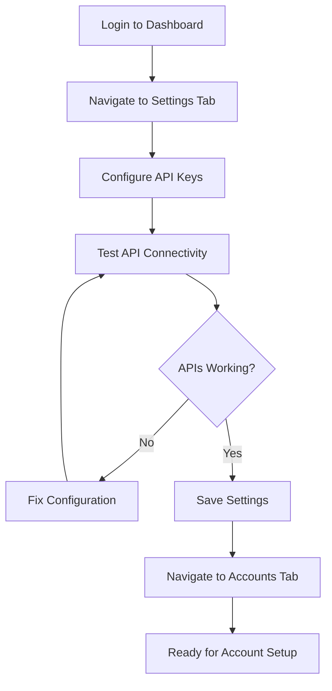
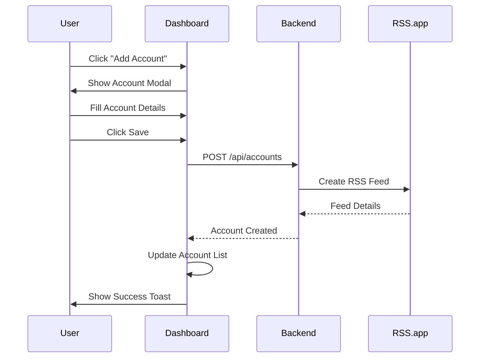
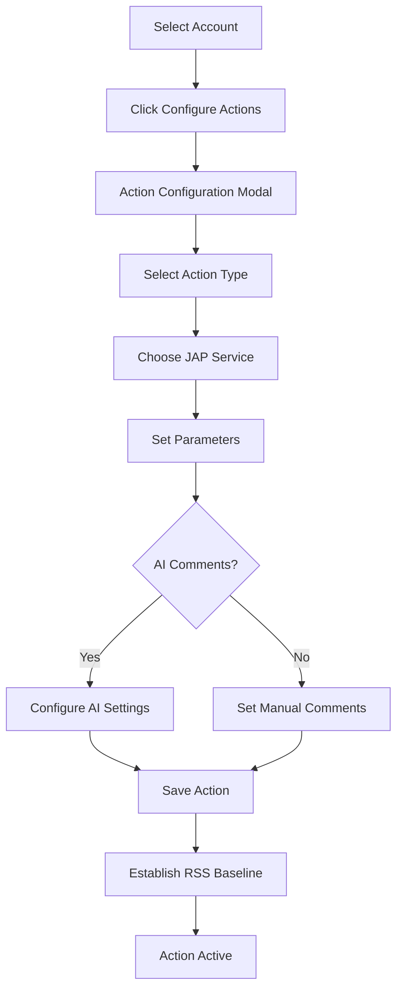
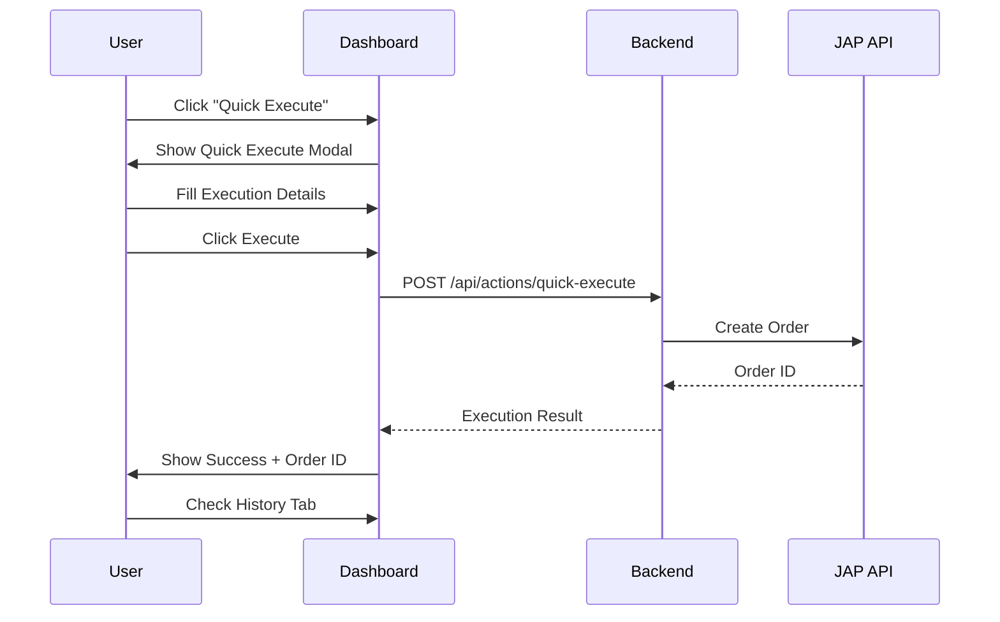
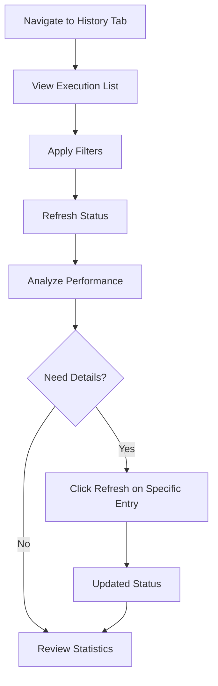
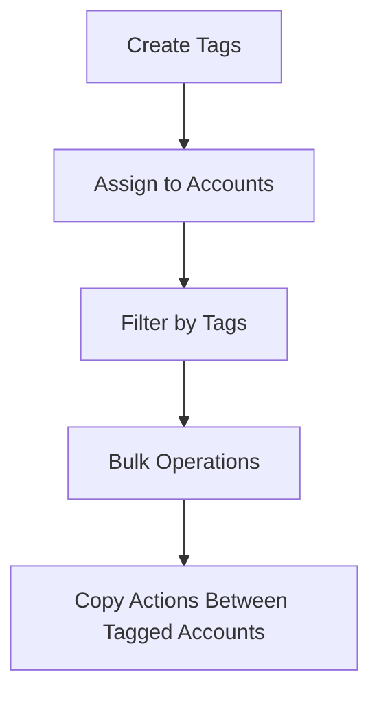
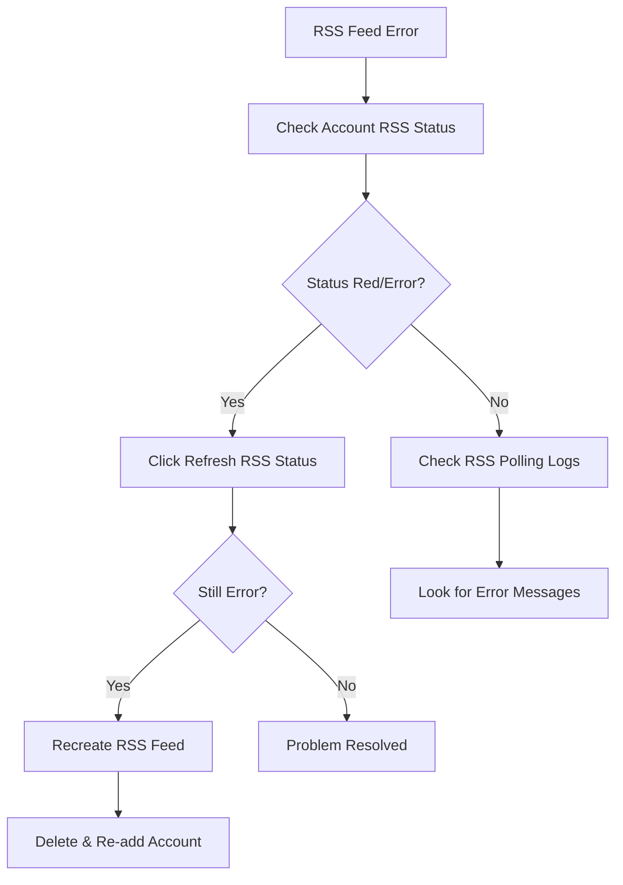

# User Workflows

This document describes common user interaction patterns and workflows in the JAP Dashboard interface.

## Overview

The JAP Dashboard is organized around **4 main tabs**, each serving distinct user needs:

1. **Accounts** - Manage social media accounts and automation
2. **History** - Monitor execution performance and status  
3. **Logs** - View system activity and debugging information
4. **Settings** - Configure API keys and system settings

## Core User Workflows

### 1. Initial Setup Workflow

**Goal**: Configure the system for first use

#### Step-by-Step Process:
1. **Login**: Use admin credentials (default: admin/admin)
2. **Settings Tab**: Click Settings in top navigation
3. **API Configuration**:
   - Enter JAP API key
   - Enter RSS.app API key and secret  
   - Configure Flowise URL (optional)
   - Set timezone and polling interval
4. **Test APIs**: Click "Test APIs" button
5. **Save**: Click "Save Settings"
6. **Verification**: See success notifications for all tests

---

### 2. Account Setup Workflow

**Goal**: Add social media accounts for automation

#### Step-by-Step Process:
1. **Open Modal**: Click "Add Account" button
2. **Fill Form**:
   - Select platform (Instagram, Facebook, X, TikTok)
   - Enter username (without @ symbol)
   - Enter display name (optional, friendly name)
   - Enter full profile URL
   - Add tags for organization (optional)
3. **Save Account**: Click "Save Account"
4. **RSS Creation**: System automatically creates RSS feed
5. **Verification**: Account appears in table with RSS status

#### Form Validation:
- **Username**: Required, no spaces or special characters
- **Platform**: Must be selected from dropdown
- **URL**: Must be valid social media URL format
- **Tags**: Optional, can create new tags on-the-fly

---

### 3. Action Configuration Workflow

**Goal**: Set up automated actions for new posts

#### Step-by-Step Process:
1. **Select Account**: Find account in table
2. **Open Actions**: Click "Configure Actions" button
3. **Action Setup**:
   - Choose action type (likes, comments, followers, views)
   - Search and select JAP service by ID or name
   - Set quantity (within service min/max limits)
4. **Comment Configuration** (for comment actions):
   - **Manual Comments**: Enter custom comments, one per line
   - **AI Comments**: Enable AI generation with instructions
   - **AI Settings**: Set comment count, enable/disable hashtags and emojis
5. **Save Action**: Click "Save Action"
6. **Baseline**: System establishes RSS baseline automatically
7. **Verification**: Action appears in account's action list

#### Action Types Available:
- **Likes**: Automatic likes on new posts
- **Comments**: Comments (manual or AI-generated)
- **Followers**: Account followers
- **Views**: Video/story views
- **Custom**: Other services available from JAP

---

### 4. Instant Execution Workflow

**Goal**: Execute services immediately without account setup

#### Step-by-Step Process:
1. **Open Modal**: Click "Quick Execute" button (orange)
2. **Execution Setup**:
   - Select platform
   - Enter target URL (profile, post, video, etc.)
   - Choose action type
   - Search and select JAP service
   - Set quantity
   - Add custom comments if needed
3. **Cost Preview**: See estimated cost calculation
4. **Execute**: Click "Execute Order"
5. **Confirmation**: Receive order ID and success message
6. **Monitoring**: Switch to History tab to monitor progress

#### Target URL Examples:
- **Instagram Post**: `https://instagram.com/p/ABC123/`
- **Instagram Profile**: `https://instagram.com/username`
- **TikTok Video**: `https://tiktok.com/@user/video/1234567`
- **X Tweet**: `https://x.com/user/status/1234567`

---

### 5. Monitoring and Management Workflow

**Goal**: Track execution performance and system status

#### History Tab Workflow:

#### Step-by-Step Process:
1. **History Tab**: Click History in navigation
2. **Filter Options**:
   - Platform filter (Instagram, Facebook, X, TikTok)
   - Execution type (RSS Trigger vs Instant)
   - Status filter (Pending, Completed, etc.)
3. **Refresh Status**: Click "Refresh All" for bulk updates
4. **Individual Refresh**: Click refresh icon on specific entries
5. **Pagination**: Use Previous/Next for large datasets
6. **Statistics**: Review summary stats at top

#### Logs Tab Workflow:
1. **Logs Tab**: Click Logs in navigation  
2. **Filter Logs**:
   - All Activity
   - RSS Polling
   - Execution Activity
   - Account Changes
3. **Manual Actions**:
   - Poll RSS Now (manual trigger)
   - Clear Console Logs
   - Refresh Logs

---

### 6. Tag-Based Organization Workflow

**Goal**: Organize accounts using tags for better management

#### Step-by-Step Process:
1. **Create Tags**: 
   - When adding/editing accounts, type new tag names
   - Tags are created automatically with random colors
2. **Assign Tags**:
   - Multiple tags per account supported
   - Tags appear as colored badges in account table
3. **Filter by Tags**:
   - Use tag filter dropdown (appears when tags exist)
   - Support for AND/OR logic
   - "Clear all" to reset filters
4. **Copy Actions**:
   - Select source account with configured actions
   - Choose target accounts on same platform
   - Actions copied with same configuration

---

### 7. Troubleshooting Workflow

**Goal**: Diagnose and resolve system issues

#### Common Issues and Solutions:

**RSS Feed Issues:**

**API Connection Issues:**
1. **Settings Tab**: Check API configuration
2. **Test APIs**: Use "Test APIs" button
3. **Error Messages**: Review specific error details
4. **API Keys**: Verify keys are correct and have permissions
5. **Logs Tab**: Check console logs for detailed errors

**Execution Issues:**
1. **History Tab**: Check execution status
2. **JAP Balance**: Verify sufficient funds
3. **Service Availability**: Confirm JAP service is active
4. **URL Format**: Ensure target URLs are correctly formatted

---

## Advanced Workflows

### 1. Bulk Account Management

**Scenario**: Managing multiple accounts for clients

1. **Tag Strategy**:
   - Create client-specific tags (e.g., "Client-ABC", "Personal")
   - Use color coding for visual organization
2. **Action Templates**:
   - Set up one account fully with all desired actions
   - Use "Copy Actions" feature for similar accounts
3. **Monitoring**:
   - Filter by client tags for focused monitoring
   - Use execution history to track client-specific spending

### 2. A/B Testing Automation

**Scenario**: Testing different automation strategies

1. **Account Grouping**:
   - Tag accounts as "Group-A", "Group-B"
   - Configure different action parameters per group
2. **Performance Comparison**:
   - Use History tab filters to compare group performance
   - Monitor execution success rates and costs
3. **Strategy Refinement**:
   - Copy successful actions from high-performing groups
   - Adjust parameters based on results

### 3. Campaign Management

**Scenario**: Running time-limited campaigns

1. **Campaign Setup**:
   - Tag accounts with campaign identifier
   - Configure appropriate actions for campaign goals
2. **Monitoring**:
   - Use date filters in History tab
   - Track campaign-specific statistics
3. **Campaign Conclusion**:
   - Disable actions when campaign ends
   - Generate performance reports from history data

---

## User Interface Patterns

### Modal Interactions

**Standard Modal Pattern**:
1. **Trigger**: Click button or link
2. **Modal Opens**: Overlay with form
3. **Form Interaction**: Fill required fields
4. **Validation**: Real-time validation feedback
5. **Submission**: Loading state during processing
6. **Result**: Success/error toast notification
7. **Modal Closes**: Return to previous view with updated data

### Toast Notifications

**Success Messages**:
- Account created successfully
- Action saved and activated  
- RSS baseline established
- Settings saved

**Error Messages**:
- API connection failed
- Invalid form data
- Insufficient balance
- Service unavailable

### Loading States

**Button Loading**: Buttons show spinner and disable during processing
**Table Loading**: Skeleton rows or spinner for data loading
**Status Updates**: Real-time status indicators during refreshes

### Form Validation

**Real-time Validation**:
- Username format checking
- URL format validation  
- Required field highlighting
- Service parameter validation

**Error Display**:
- Inline error messages
- Field highlighting
- Toast notifications for submission errors

---

## Keyboard Shortcuts and Accessibility

### Keyboard Navigation
- **Tab**: Navigate through interactive elements
- **Enter**: Activate buttons and submit forms
- **Escape**: Close modals and dropdowns
- **Arrow Keys**: Navigate dropdown options

### Accessibility Features
- **Focus Indicators**: Clear visual focus states
- **Screen Reader Support**: Proper ARIA labels
- **Keyboard Access**: All functionality available via keyboard
- **Color Contrast**: Sufficient contrast ratios for readability

This user workflow documentation provides comprehensive guidance for effectively using the JAP Dashboard interface, from initial setup through advanced automation management.